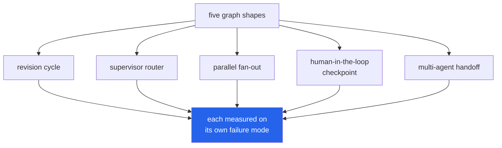

<h1 align="center">langgraph-lab (LangGraph · LangChain · Ollama · Pydantic)</h1>
<p align="center"><i>One project per LangGraph shape, each built around the failure it is usually demoed past</i></p>

<p align="center">
  <a href="#the-through-line">The through-line</a> &middot;
  <a href="#projects">Projects</a> &middot;
  <a href="#the-model-fleet">The model fleet</a> &middot;
  <a href="#screenshots">Screenshots</a> &middot;
  <a href="#what-this-repo-does-not-do">What it does NOT do</a> &middot;
  <a href="#problems-hit-while-building-this">Problems hit</a>
</p>

<p align="center">
  <a href="https://github.com/hammasbuilds/langgraph-lab/actions/workflows/ci.yml"></a>
  
  
  
  <a href="LICENSE"></a>
</p>

---

## The through-line



One project per LangGraph-specific shape, rather than five variations on the same graph.
Every one runs on local models - no API key, no hosted call, no cost.


Each project takes a graph shape LangGraph is demonstrated with, and asks what happens at the
place the demo stops looking. None of the five findings were the one the project was built
around — the actual result came from testing the assumption directly rather than trusting it.

> **The graph does the mechanical part correctly. Whether anyone notices when something still
> goes wrong is a separate question, and the answer on this run was usually no.**

## Projects

| | Project | The finding | Tests |
|---|---|---|---|
| [**01**](projects/p01_revision_loops/) | [**Does the revision loop converge?**](projects/p01_revision_loops/) | Doubling a critique-revise loop from 3 to 6 iterations changed **nothing** on every task tested. Letting the loop self-report "done" made it quit on the **first draft**, every time. | 13 |
| [**02**](projects/p02_router_misroute/) | [**Does the router know when it's guessing?**](projects/p02_router_misroute/) | Gating dispatch on the router's own confidence dropped clean-ticket accuracy from **100% to 33%** — confidence ran backwards, unconfident on easy tickets it got right, confident on the one it got wrong. | 17 |
| [**03**](projects/p03_parallel_merge/) | [**The synthesis that reads as complete**](projects/p03_parallel_merge/) | Every silent branch failure in a 4-way fan-out produced a report covering all four aspects by name, **0% disclosure**. Explicitly asking the synthesis to flag gaps caught it half the time. | 15 |
| [**04**](projects/p04_checkpoint_resume/) | [**Does resuming redo work?**](projects/p04_checkpoint_resume/) | A "pause for approval" pattern built without `interrupt()` cost **50% more drafting calls** than the checkpointed version — one wasted redraft, every single time, on identical final output. | 10 |
| [**05**](projects/p05_supervisor_handoff/) | [**Does the constraint survive the handoff?**](projects/p05_supervisor_handoff/) | Passing only the latest message to a handed-off specialist dropped safety from **100% to 20%** — recommending eggs to a vegan customer, a hotel with no accessibility mention to someone who required it. | 19 |

All five are built. 74 tests, 28 screenshots.

### 01 · Does the revision loop actually converge? — 13 tests

A real `generate -> critique -> revise -> critique -> ...` cycle, scored against a fixed
checklist so "improved" is a number. Doubling the loop from 3 to 6 iterations produced
**zero additional improvement on every one of six tasks** — every trajectory is flat past
iteration 3. Letting the critique node decide when to stop made it approve the very first
draft as complete on **all six tasks**, behaving exactly like doing no revision at all.

- **Stack:** `langgraph`, `langchain-ollama`
- **In:** a question, a stopping strategy
- **Out:** the score after every iteration, so a plateau or regression is visible as a trace

### 02 · Does the router know when it's guessing? — 17 tests

A supervisor node classifies support tickets and states its own confidence. On every
**clean, unambiguous** ticket, the router got the category right and reported only MEDIUM
confidence; on the one genuinely cross-cutting ticket, it was confidently wrong. Gating on
confidence therefore made things worse, not better — accuracy on easy tickets fell from 100%
to 33% while barely touching the hard case it was built for.

- **Stack:** `langgraph`, `langchain-ollama`
- **In:** a support ticket, a dispatch strategy
- **Out:** the routing decision, confidence, and — separately — whether the confidence gate
  actually removed the payload or the model just declined it on its own

### 03 · The synthesis that reads as complete when a branch failed — 15 tests

Four analyst branches run as genuine LangGraph parallelism into one synthesis node. One branch
is forced to fail — a stand-in for a timed-out tool call. In **every** run, the synthesis
report covered all four aspects by name with **zero disclosure** that one had failed.
Explicitly instructing the synthesis to flag gaps caught it in 2 of 4 cases — better than
never, far from reliable.

- **Stack:** `langgraph`, `langchain-ollama`
- **In:** a company brief, which branch (if any) is forced to fail
- **Out:** every branch's finding beside the synthesised report, and whether the failure was
  disclosed

### 04 · Does resuming re-run work that already happened? — 10 tests

Two ways to build "pause for human approval." One uses LangGraph's real `interrupt()` plus a
checkpointer, which genuinely suspends a run. The other looks identical from outside a single
request — an early return, re-invoked from scratch once approval arrives — and costs exactly
**one extra drafting call every time**, regardless of how many revision rounds preceded it: a
flat 50% overhead across three scenarios, for output that is otherwise correct.

- **Stack:** `langgraph` (`interrupt`, `Command`, `MemorySaver`), `langchain-ollama`
- **In:** a refund scenario, a scripted sequence of reviewer feedback
- **Out:** exactly how many times the drafting node ran under each strategy

### 05 · Does the constraint survive the handoff? — 19 tests

A customer states a hard constraint — an allergy, a budget, a rejected product — to an intake
agent before a supervisor hands off to a specialist. The constraint is never repeated. Full
context kept safety at 100%; a generated handoff summary kept it at 80%; passing only the
customer's latest message dropped it to **20%** — recommending eggs to a strictly vegan
customer and a beach hotel with no mention of accessibility to someone who explicitly required
a wheelchair-accessible stay.

- **Stack:** `langgraph`, `langchain-ollama`
- **In:** a two-agent conversation, a handoff strategy
- **Out:** what the specialist actually received, its response, and whether it stayed on
  topic **and** respected the constraint — scored separately, because a response that goes
  silent on the topic breaks no rule either

## The model fleet

`shared/models.py` is shared with `langchain-lab`: a capability-based registry rather than
hard-coded tags, so a project asks for "something that can call tools" and the benchmark runs
on whatever is actually pulled.

| model | params | role |
|---|---|---|
| `granite3.3:2b` | 2.5B | the floor |
| `qwen2.5:3b-instruct` | 3.1B | default — every number in this repo's READMEs used this one |
| `qwen2.5-coder:3b` | 3.1B | structured text |
| `llama3.2:3b` | 3.2B | a second model family |
| `qwen2.5:7b-instruct` | 7.6B | the quality ceiling |

## Quick start

```bash
git clone https://github.com/hammasbuilds/langgraph-lab
cd langgraph-lab

make install
ollama pull qwen2.5:3b-instruct

make test           # 74 tests, no GPU and no ollama needed
make bench           # regenerates every RESULTS.md from real graph runs
```

---

## Input / Output

Project 01, the cheapest finding in the lab to act on.


*Three iterations and six iterations produce the same score. The extra three revisions
cost 75% more calls and bought zero points, and no run regressed, so the loop is not even
trading accuracy for compute — it is simply idling.*

*`self_stop` is the one to be careful with. It never revised at all: asked whether its own
answer was finished, the model said yes every time. A self-terminating loop that always
terminates immediately is indistinguishable from having no loop, and costs the same as
one pass.*

## Layout

```
shared/
  models.py            the fleet registry, shared with langchain-lab
  llm.py               chat/embeddings + Ledger, the callback that counts calls
  web/                 design system and templates, shared by every project's UI
projects/
  p01_revision_loops/    generate -> critique -> revise, an actual LangGraph cycle
  p02_router_misroute/   a supervisor node, its confidence, and whether it means anything
  p03_parallel_merge/    a real fan-out into one synthesis node
  p04_checkpoint_resume/ interrupt() + checkpointer against a naive re-invoke pattern
  p05_supervisor_handoff/ what a specialist actually receives when control passes to it
scripts/shoot.mjs      drives the real app in a real browser for every screenshot
```

## Requirements

Python 3.11+, `uv`, and ollama running locally. No GPU is required for the test suite — only
for the benchmarks and the UIs.

## Tests

```bash
make test         # 74, deselects the `live` mark
make test-live    # adds the tests that need a running ollama
```

Corpus invariants, scoring functions and derived `RunResult` properties are pure and covered
without a model; project 04's numbers are inherently about real call counts and its assertions
live entirely behind the `live` mark, which the README says explicitly.

## Screenshots

Every image is a real capture of the running app via Playwright, in both colour schemes. 28
across five projects, none a mockup.

## What this repo does NOT do

- **It does not test hosted models.** Every number is `qwen2.5:3b-instruct` on one machine.
- **It is not a LangGraph tutorial.** It assumes you know what a node and an edge are and goes
  at the five places a graph like that is usually demoed past.
- **It does not benchmark LangGraph against alternatives.** LangGraph is the tool under test,
  not the subject of comparison.

## Problems hit while building this

Full accounts are in each project's README. Two that generalise past a single project:

- **LangGraph raises `InvalidUpdateError` on a genuinely conflicting concurrent write** —
  including when a parallel node spreads `{**state, ...}` and re-submits every unchanged field
  as an update to itself, not only when two branches disagree about a real value. A parallel
  node must return only its own delta, and any dict-valued key written from more than one
  branch needs an explicit reducer.
- **A live `Ledger` cannot live inside checkpointed state.** LangGraph's checkpointer
  serialises state between invocations; a callback handler stored there comes back as a
  disconnected deserialised copy on every resume, silently under-counting real model calls.
  Call counters belong in a plain registry keyed by a checkpoint-safe string, never in the
  graph's own state.

## Keywords

LangGraph &middot; LangChain &middot; agent orchestration &middot; state machines &middot; multi-agent &middot; supervisor pattern &middot; human-in-the-loop &middot; checkpointing &middot; parallel agents &middot; agent handoff &middot; local LLM &middot; Ollama &middot; LLM workflows &middot; graph-based agents &middot; reproducible evaluation

## License

MIT